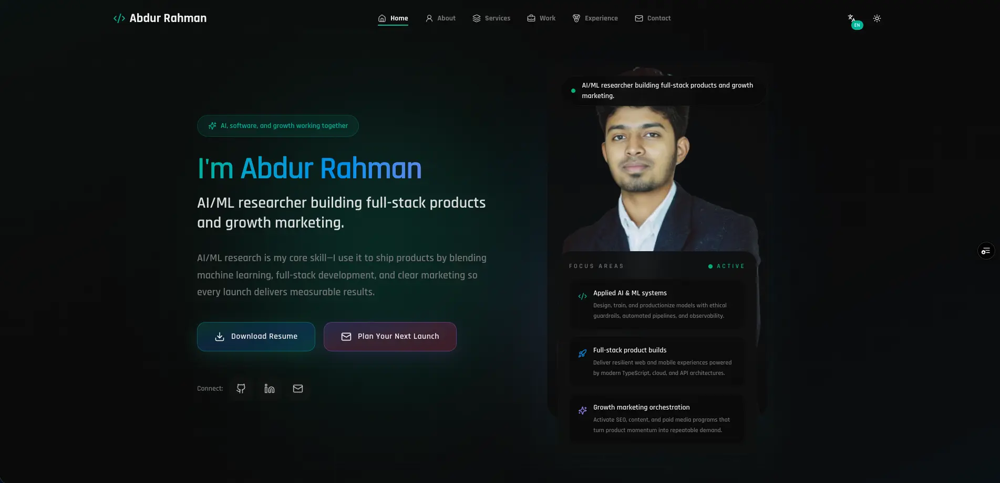

# Abdur Rahman — Full Stack Engineering & Growth Partner

AI/ML researcher and full-stack engineer combining product development with digital marketing execution. I build launch-ready software, automate data-driven workflows, and craft go-to-market systems that keep products growing after release.

## Snapshot

- Based in Debiganj, Panchagarh · collaborating globally
- Focused on applied AI/ML, resilient TypeScript platforms, and measurable growth campaigns
- Available for fractional leadership, project-based delivery, and advisory retainers
- Typical response time: within one business day

## What I Deliver

| Pillar | Outcomes |
| --- | --- |
| Applied AI & ML systems | Model experimentation, evaluation pipelines, and production MLOps with ethical guardrails.
| Full-stack product builds | Next.js frontends, API-driven backends, and cloud-native infrastructure engineered for scale.
| Growth marketing orchestration | SEO, content, and paid media programs that translate launches into sustainable demand.

Every engagement blends research, engineering, and storytelling so complex ideas become human-centered products with clear ROI.

## Selected Collaborations

| Project | Brief | Highlights |
| --- | --- | --- |
| [Finance Pro](https://financepr.vercel.app) | Enterprise financial management platform with dashboards and forecasting. | Next.js, Node, PostgreSQL, analytics-driven reporting, executive-ready insights. |
| [Rare Bangladesh Ltd](https://rarebd.com) | Corporate HVAC experience that streamlines product discovery and dealer outreach. | React, Node.js, MongoDB, marketing automation, multilingual content workflows. |
| [Radhuni](https://radhuni-zeta.vercel.app) | Chef and private event marketplace with scheduling and secure payments. | Next.js, Tailwind CSS, Vercel, booking flows, growth-focused launch plan. |

## Capabilities

- AI/ML engineering: data sourcing, feature pipelines, evaluation frameworks, and responsible deployment practices.
- Full-stack product development: design systems, React and Next.js applications, Node/Nest services, and database architecture.
- Platform operations: CI/CD, observability, infrastructure-as-code, and cloud-native automation on AWS and Vercel.
- Growth strategy: positioning, narrative design, SEO roadmaps, and integrated campaign orchestration.
- Collaboration: cross-functional enablement, documentation-first workflows, and outcome-based reporting for stakeholders.

## Toolkit

- Languages: TypeScript, JavaScript, Python, SQL, HTML, CSS, Java.
- Frameworks: Next.js, React, Angular, NestJS, Express, GraphQL, Prisma.
- Infrastructure: AWS, Vercel, Docker, PostgreSQL, MySQL, MongoDB.
- Product & DX: Git, GitHub Actions, Jest, Testing Library, Postman, Storybook, Figma.

## Work With Me

- Website: [abdurrahmans.vercel.app](https://abdurrahmans.vercel.app)
- Email: [abdurrahmansoftw@gmail.com](mailto:abdurrahmansoftw@gmail.com)
- LinkedIn: [linkedin.com/in/abdurrahmanse](https://linkedin.com/in/abdurrahmanse)
- GitHub: [github.com/abdurrahmanse](https://github.com/abdurrahmanse)
- YouTube: [youtube.com/@abdurrahmanse](https://youtube.com/@abdurrahmanse)
- X (Twitter): [twitter.com/abdurrahmansoftw](https://twitter.com/abdurrahmansoftw)
- Resume: [Download PDF](https://abdurrahmans.vercel.app/resume/resume.pdf)

Ready to plan your next launch? Share the mission, and I will outline the blend of software, automation, and marketing that makes it real.
